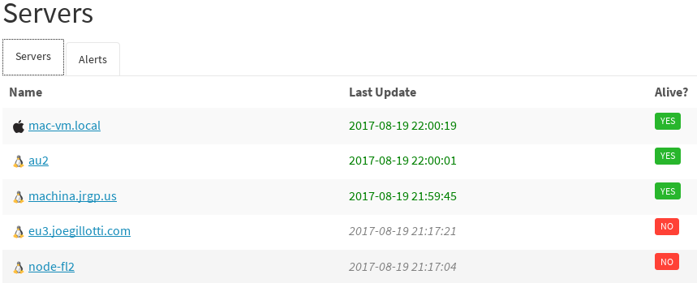
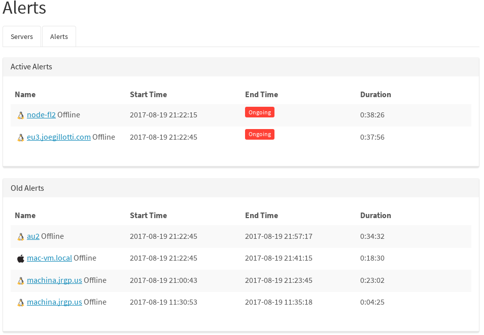

# HealthApp

Open source (MIT) Python Replacement for New Relic's deprecated server health monitoring solution.

## Components:

###### API Server

- stateless falcon app. you can spin up several behind a balancer.
- listens for updates from server agents
- provides api access to list servers and alerts
- provides web UI (a single page app) which pulls from the API endpoints
  and displays them nicely

###### Alert Processor

- stateful service. only run one of these at once (until i add leader election)
- periodically poll redis for the latest server statuses, and intelligently
  create, maintain, and close alerts as events change
- handles notifications (currently email based) for alert state transitions

###### Agent

- run this on each server that needs to be monitored. periodically POSTs to API Server

###### Redis

- all state (servers, alerts, etc) is stored in redis. If you need this to scale, you can put a proxy in front of a pool of redis servers for durability + sharding.

## Quickstart (for developers)

Run the following in each host which will run the app:

    # clone repo
    virtualenv env
    . env/bin/activate
    pip install -r requirements.txt
    python setup.py develop

Copy sample config file. This can be placed in `/etc/healthapp/config.yaml` or any other path specified by `CONFIG_FILE` env var, otherwise `config.yaml` in the current directory.

    cp config.sample.yaml config.yaml

To start API server (in dev mode)

    ./run_dev_server

To start the alert processor:

    alert-processor

To start slave agent:

    agent

## Meta

- more docs will come
- MIT licensed
- Open a GitHub issue or email me at joe@u13.net with any questions.